# Pipeline DAG

This is the dependency graph for `pipeline/*.py` scripts, derived from
their actual file I/O. The numeric naming (01, 02, 03, …) is misleading
— several lower-numbered scripts depend on higher-numbered scripts. See
`pipeline/dag.toml` for the machine-readable version.

## Key findings from the I/O survey

- **One real forward dependency**: `06_branch_empirics.py` reads
  `results/10_temporal_scores/temporal_composition_myeloid.csv`, so it
  must run *after* `10_temporal_scores.py` and `10b_temporal_scores_myeloid.py`
  despite its `06_` prefix.
- **Three scripts use hard-coded absolute paths** (will break on any
  other machine): `09_clonal_trafficking.py`, `10b_temporal_scores_myeloid.py`,
  `12_liana_signaling.py`.
- **One script has no `REPO_ROOT`**: `celltyping.py`. Only runnable
  with `cwd == pipeline/`.
- **One directory name mismatch**: `08_transcriptome_similarity.py`
  writes to `results/06_transcriptome_similarity/`.

## Graph

```mermaid
flowchart TD
    classDef qc       fill:#e8f0ff,stroke:#2a5db0,color:#0e1a2e;
    classDef traffic  fill:#fff1d6,stroke:#a87521,color:#3a2a08;
    classDef signaling fill:#ffe1eb,stroke:#a3387c,color:#3a0e25;
    classDef pathway  fill:#dff5d8,stroke:#3a7a26,color:#0e2e0a;
    classDef figure   fill:#f3e0ff,stroke:#6b2eaa,color:#2a0a47;
    classDef explorer fill:#d8f0f5,stroke:#246f7a,color:#0a2e33;

    %% QC
    scrublet["scrublet_doublet_qc"]:::qc
    celltyping["celltyping"]:::qc

    %% Trafficking — leaves
    sep03["03_tissue_separability"]:::traffic
    qc06c["06c_empirical_Q"]:::traffic
    qd06d["06d_empirical_Q_per_timepoint"]:::traffic
    qg06g["06g_bayesian_sankey"]:::traffic
    sim08["08_transcriptome_similarity"]:::traffic
    clo09["09_clonal_trafficking"]:::traffic
    tem09["09_temporal_trajectories"]:::traffic
    pst13["13_pseudotime_phenotypes"]:::traffic
    bdisp["branch_dispersion"]:::traffic
    clon["clonality"]:::traffic

    %% Trafficking — downstream
    qe06e["06e_empirical_Q_figures"]:::traffic
    qf06f["06f_bayesian_comparison"]:::traffic
    deg14["14_phenotype_degs"]:::traffic
    djsd["branch_dispersion_jsd"]:::traffic
    dsw["branch_dispersion_switching"]:::traffic
    dtemp["branch_dispersion_temporal"]:::traffic
    be06["06_branch_empirics"]:::traffic

    %% Pathway
    p04["04_pseudobulk_de_gsea"]:::pathway
    p05["05_pathway_ternary"]:::pathway
    p06pc["06_pathway_coenrichment_graph"]:::pathway
    p07pn["07_pathway_proximity_network"]:::pathway
    ts10["10_temporal_scores"]:::pathway
    ts10b["10b_temporal_scores_myeloid"]:::pathway
    cl11["11_cross_lineage_correlations"]:::pathway
    cl11a["11a_cross_lineage_correlations_fine"]:::pathway

    %% Signaling
    bs06b["06b_branch_signaling"]:::signaling
    lia12["12_liana_signaling"]:::signaling
    lia12b["12b_intersect_signaling"]:::signaling

    %% Figure
    fig07["07_figure2_trafficking"]:::figure

    %% Explorers
    ex_t["build_explorer"]:::explorer
    ex_s["build_signaling_explorer"]:::explorer
    ex_cn["clone_network_explorer"]:::explorer
    rep["build_report"]:::explorer

    %% Edges
    p04 --> p05
    p04 --> p06pc
    p04 --> p07pn
    qc06c --> qe06e
    qc06c --> qf06f
    qc06c --> dtemp
    qd06d --> dtemp
    ts10 --> ts10b
    ts10 --> cl11
    ts10 --> cl11a
    ts10b --> cl11
    ts10b --> cl11a
    ts10b --> be06
    be06 --> djsd
    be06 --> dsw
    be06 --> ex_cn
    pst13 --> deg14
    ts10 --> lia12
    cl11 --> lia12
    lia12 --> lia12b
    qc06c --> fig07
    qd06d --> fig07
    sim08 --> fig07
    ts10 --> ex_t
    lia12 --> ex_s
    cl11 --> ex_s
```

## Topological order (one valid execution order)

The DAG has roots (no dependencies) and successors. Any topological
ordering works; the one below groups by depth so logical batches run
together.

**Wave 0 — QC**
- `scrublet_doublet_qc`

**Wave 1 — independent analyses (no upstream `results/` deps)**
- `03_tissue_separability`
- `04_pseudobulk_de_gsea`
- `06c_empirical_Q`
- `06d_empirical_Q_per_timepoint`
- `06g_bayesian_sankey`
- `06b_branch_signaling`
- `08_transcriptome_similarity`
- `09_clonal_trafficking`
- `09_temporal_trajectories`
- `10_temporal_scores`
- `13_pseudotime_phenotypes`
- `branch_dispersion`
- `clonality`

**Wave 2 — depend on wave 1 outputs**
- `05_pathway_ternary`             (← 04)
- `06_pathway_coenrichment_graph`  (← 04)
- `06e_empirical_Q_figures`        (← 06c)
- `06f_bayesian_comparison`        (← 06c)
- `07_pathway_proximity_network`   (← 04)
- `10b_temporal_scores_myeloid`    (← 10)
- `14_phenotype_degs`              (← 13)
- `branch_dispersion_temporal`     (← 06c, 06d)
- `07_figure2_trafficking`         (← 06c, 06d, 08)
- `build_explorer`                 (← 10)

**Wave 3 — depend on wave 2 outputs**
- `06_branch_empirics`             (← 10b)       ← the forward-dep one
- `11_cross_lineage_correlations`  (← 10b)
- `11a_cross_lineage_correlations_fine` (← 10b)

**Wave 4 — depend on wave 3 outputs**
- `branch_dispersion_jsd`          (← 06_branch_empirics)
- `branch_dispersion_switching`    (← 06_branch_empirics)
- `clone_network_explorer`         (← 06_branch_empirics)
- `12_liana_signaling`             (← 11, 10)

**Wave 5**
- `12b_intersect_signaling`        (← 12)
- `build_signaling_explorer`       (← 12, 11)

**Wave ∞ — aggregator**
- `build_report`                   (← results/ broadly)

## Proposed rename (subject to your approval)

Domain prefixes: `qc_`, `traffic_`, `signaling_`, `pathway_`, `figure_`,
`explorer_`. Below is the full mapping; numbers go away.

| current | proposed | domain |
|---|---|---|
| scrublet_doublet_qc.py | qc_scrublet_doublets.py | qc |
| celltyping.py | qc_celltyping.py | qc |
| 04_pseudobulk_de_gsea.py | pathway_de_gsea_prerank.py | pathway |
| 05_pathway_ternary.py | pathway_tissue_ternary.py | pathway |
| 06_pathway_coenrichment_graph.py | pathway_coenrichment_graph.py | pathway |
| 07_pathway_proximity_network.py | pathway_proximity_network.py | pathway |
| 10_temporal_scores.py | pathway_temporal_scores_tcell.py | pathway |
| 10b_temporal_scores_myeloid.py | pathway_temporal_scores_myeloid.py | pathway |
| 11_cross_lineage_correlations.py | pathway_cross_lineage_corr.py | pathway |
| 11a_cross_lineage_correlations_fine.py | pathway_cross_lineage_corr_fine.py | pathway |
| 03_tissue_separability.py | traffic_tissue_separability.py | traffic |
| 06_branch_empirics.py | traffic_branch_empirics.py | traffic |
| 06c_empirical_Q.py | traffic_migration_rates.py | traffic |
| 06d_empirical_Q_per_timepoint.py | traffic_migration_rates_per_tp.py | traffic |
| 06e_empirical_Q_figures.py | traffic_migration_rates_figures.py | traffic |
| 06f_bayesian_comparison.py | traffic_bayesian_comparison.py | traffic |
| 06g_bayesian_sankey.py | traffic_bayesian_sankey.py | traffic |
| 08_transcriptome_similarity.py | traffic_transcriptome_cosine.py | traffic |
| 09_clonal_trafficking.py | traffic_clonal_persistence.py | traffic |
| 09_temporal_trajectories.py | traffic_temporal_trajectories.py | traffic |
| 13_pseudotime_phenotypes.py | traffic_pseudotime_phenotypes.py | traffic |
| 14_phenotype_degs.py | traffic_phenotype_degs.py | traffic |
| branch_dispersion.py | traffic_branch_dispersion.py | traffic |
| branch_dispersion_jsd.py | traffic_branch_dispersion_jsd.py | traffic |
| branch_dispersion_switching.py | traffic_branch_dispersion_switching.py | traffic |
| branch_dispersion_temporal.py | traffic_branch_dispersion_temporal.py | traffic |
| clonality.py | traffic_clonality.py | traffic |
| 06b_branch_signaling.py | signaling_branch_intersection.py | signaling |
| 12_liana_signaling.py | signaling_liana_pathways.py | signaling |
| 12b_intersect_signaling.py | signaling_intersect_pathways.py | signaling |
| 07_figure2_trafficking.py | figure_main2_trafficking.py | figure |
| build_explorer.py | explorer_temporal.py | explorer |
| build_signaling_explorer.py | explorer_signaling.py | explorer |
| clone_network_explorer.py | explorer_clone_network.py | explorer |
| build_report.py | explorer_full_report.py | explorer |

**Results directories will be renamed in a follow-up pass.** Renaming
scripts alone keeps the existing `results/*/` paths intact (good — none
of the cached intermediate CSVs need to move). Once the script rename
is approved, I'll either:
  (a) leave `results/` directory names as-is, with `paths.py` constants
      hiding the legacy names, or
  (b) rename `results/` dirs in a separate commit so files and dirs match.
