# Pipeline DAG

Auto-generated from [`manifest.yaml`](manifest.yaml). Regenerate with:

```bash
python pipeline/workflow/render_from_manifest.py
```

See [`AUDIT.md`](AUDIT.md) for lineage and TCR constraints.

## Tiers

- **qc**: `qc_scrublet_doublets`
- **pathway_tcell**: `pathway_coenrichment_graph`, `pathway_de_gsea_prerank`, `pathway_proximity_network`, `pathway_temporal_scores_tcell`, `pathway_tissue_ternary`
- **pathway_myeloid**: `pathway_de_gsea_myeloid`, `pathway_temporal_scores_myeloid`, `traffic_tissue_separability_myeloid`, `traffic_transcriptome_cosine_myeloid`
- **pathway_cross**: `pathway_cross_lineage_corr`, `pathway_cross_lineage_corr_fine`
- **traffic_tcr**: `traffic_bayesian_comparison`, `traffic_bayesian_sankey`, `traffic_branch_dispersion`, `traffic_branch_dispersion_jsd`, `traffic_branch_dispersion_switching`, `traffic_branch_dispersion_temporal`, `traffic_branch_empirics`, `traffic_clonal_persistence`, `traffic_clonality`, `traffic_migration_rates`, `traffic_migration_rates_figures`, `traffic_migration_rates_per_tp`, `traffic_phenotype_degs`, `traffic_pseudotime_phenotypes_cd4`, `traffic_pseudotime_phenotypes_cd8`, `traffic_temporal_trajectories`, `traffic_tissue_separability`, `traffic_transcriptome_cosine`
- **signaling**: `signaling_branch_intersection`, `signaling_intersect_pathways`, `signaling_liana_pathways`
- **figures**: `figure_main2_trafficking`
- **explorers**: `explorer_clone_network`, `explorer_full_report`, `explorer_signaling`, `explorer_temporal`, `viewer_landing`

## Graph

```mermaid
flowchart TD
    explorer_clone_network["explorer clone network"]:::explorer
    explorer_full_report["explorer full report"]:::explorer
    explorer_signaling["explorer signaling"]:::explorer
    explorer_temporal["explorer temporal"]:::explorer
    figure_main2_trafficking["figure main2 trafficking"]:::figure
    pathway_coenrichment_graph["pathway coenrichment graph"]:::pathway
    pathway_cross_lineage_corr["pathway cross lineage corr"]:::pathway
    pathway_cross_lineage_corr_fine["pathway cross lineage corr fine"]:::pathway
    pathway_de_gsea_myeloid["pathway de gsea myeloid"]:::pathway
    pathway_de_gsea_prerank["pathway de gsea prerank"]:::pathway
    pathway_proximity_network["pathway proximity network"]:::pathway
    pathway_temporal_scores_myeloid["pathway temporal scores myeloid"]:::pathway
    pathway_temporal_scores_tcell["pathway temporal scores tcell"]:::pathway
    pathway_tissue_ternary["pathway tissue ternary"]:::pathway
    qc_scrublet_doublets["qc scrublet doublets"]:::qc
    signaling_branch_intersection["signaling branch intersection"]:::signaling
    signaling_intersect_pathways["signaling intersect pathways"]:::signaling
    signaling_liana_pathways["signaling liana pathways"]:::signaling
    traffic_bayesian_comparison["traffic bayesian comparison"]:::traffic
    traffic_bayesian_sankey["traffic bayesian sankey"]:::traffic
    traffic_branch_dispersion["traffic branch dispersion"]:::traffic
    traffic_branch_dispersion_jsd["traffic branch dispersion jsd"]:::traffic
    traffic_branch_dispersion_switching["traffic branch dispersion switching"]:::traffic
    traffic_branch_dispersion_temporal["traffic branch dispersion temporal"]:::traffic
    traffic_branch_empirics["traffic branch empirics"]:::traffic
    traffic_clonal_persistence["traffic clonal persistence"]:::traffic
    traffic_clonality["traffic clonality"]:::traffic
    traffic_migration_rates["traffic migration rates"]:::traffic
    traffic_migration_rates_figures["traffic migration rates figures"]:::traffic
    traffic_migration_rates_per_tp["traffic migration rates per tp"]:::traffic
    traffic_phenotype_degs["traffic phenotype degs"]:::traffic
    traffic_pseudotime_phenotypes_cd4["traffic pseudotime phenotypes cd4"]:::traffic
    traffic_pseudotime_phenotypes_cd8["traffic pseudotime phenotypes cd8"]:::traffic
    traffic_temporal_trajectories["traffic temporal trajectories"]:::traffic
    traffic_tissue_separability["traffic tissue separability"]:::traffic
    traffic_tissue_separability_myeloid["traffic tissue separability myeloid"]:::pathway
    traffic_transcriptome_cosine["traffic transcriptome cosine"]:::traffic
    traffic_transcriptome_cosine_myeloid["traffic transcriptome cosine myeloid"]:::pathway
    viewer_landing["viewer landing"]:::explorer
    qc_scrublet_doublets --> explorer_clone_network
    traffic_branch_empirics --> explorer_clone_network
    signaling_liana_pathways --> explorer_signaling
    pathway_cross_lineage_corr --> explorer_signaling
    pathway_temporal_scores_tcell --> explorer_temporal
    pathway_temporal_scores_myeloid --> explorer_temporal
    qc_scrublet_doublets --> figure_main2_trafficking
    traffic_migration_rates --> figure_main2_trafficking
    traffic_migration_rates_per_tp --> figure_main2_trafficking
    traffic_transcriptome_cosine --> figure_main2_trafficking
    pathway_de_gsea_prerank --> pathway_coenrichment_graph
    pathway_temporal_scores_tcell --> pathway_cross_lineage_corr
    pathway_temporal_scores_myeloid --> pathway_cross_lineage_corr
    pathway_temporal_scores_tcell --> pathway_cross_lineage_corr_fine
    pathway_temporal_scores_myeloid --> pathway_cross_lineage_corr_fine
    qc_scrublet_doublets --> pathway_de_gsea_prerank
    pathway_de_gsea_prerank --> pathway_proximity_network
    pathway_temporal_scores_tcell --> pathway_temporal_scores_myeloid
    qc_scrublet_doublets --> pathway_temporal_scores_tcell
    pathway_de_gsea_prerank --> pathway_tissue_ternary
    signaling_liana_pathways --> signaling_intersect_pathways
    pathway_temporal_scores_tcell --> signaling_liana_pathways
    pathway_cross_lineage_corr --> signaling_liana_pathways
    qc_scrublet_doublets --> traffic_bayesian_comparison
    traffic_migration_rates --> traffic_bayesian_comparison
    qc_scrublet_doublets --> traffic_bayesian_sankey
    traffic_migration_rates --> traffic_bayesian_sankey
    qc_scrublet_doublets --> traffic_branch_dispersion
    traffic_branch_empirics --> traffic_branch_dispersion_jsd
    traffic_branch_empirics --> traffic_branch_dispersion_switching
    traffic_migration_rates --> traffic_branch_dispersion_temporal
    traffic_migration_rates_per_tp --> traffic_branch_dispersion_temporal
    qc_scrublet_doublets --> traffic_branch_empirics
    pathway_temporal_scores_myeloid --> traffic_branch_empirics
    qc_scrublet_doublets --> traffic_clonal_persistence
    qc_scrublet_doublets --> traffic_clonality
    qc_scrublet_doublets --> traffic_migration_rates
    traffic_migration_rates --> traffic_migration_rates_figures
    qc_scrublet_doublets --> traffic_migration_rates_per_tp
    traffic_pseudotime_phenotypes_cd8 --> traffic_phenotype_degs
    traffic_pseudotime_phenotypes_cd4 --> traffic_phenotype_degs
    qc_scrublet_doublets --> traffic_pseudotime_phenotypes_cd4
    qc_scrublet_doublets --> traffic_pseudotime_phenotypes_cd8
    qc_scrublet_doublets --> traffic_temporal_trajectories
    qc_scrublet_doublets --> traffic_tissue_separability
    qc_scrublet_doublets --> traffic_transcriptome_cosine
    explorer_temporal --> viewer_landing
    explorer_signaling --> viewer_landing
    explorer_clone_network --> viewer_landing
    explorer_full_report --> viewer_landing
```



## Topological waves

**Wave 0**
- `explorer_full_report` — lineage: both
- `pathway_de_gsea_myeloid` — lineage: myeloid
- `qc_scrublet_doublets` — lineage: tcell
- `signaling_branch_intersection` — lineage: tcell (TCR)
- `traffic_tissue_separability_myeloid` — lineage: myeloid
- `traffic_transcriptome_cosine_myeloid` — lineage: myeloid

**Wave 1**
- `pathway_de_gsea_prerank` — lineage: tcell
- `pathway_temporal_scores_tcell` — lineage: tcell
- `traffic_branch_dispersion` — lineage: na (TCR)
- `traffic_clonal_persistence` — lineage: na (TCR)
- `traffic_clonality` — lineage: na (TCR)
- `traffic_migration_rates` — lineage: na (TCR)
- `traffic_migration_rates_per_tp` — lineage: na (TCR)
- `traffic_pseudotime_phenotypes_cd4` — lineage: tcell
- `traffic_pseudotime_phenotypes_cd8` — lineage: tcell
- `traffic_temporal_trajectories` — lineage: na (TCR)
- `traffic_tissue_separability` — lineage: tcell
- `traffic_transcriptome_cosine` — lineage: tcell

**Wave 2**
- `figure_main2_trafficking` — lineage: tcell
- `pathway_coenrichment_graph` — lineage: tcell
- `pathway_proximity_network` — lineage: tcell
- `pathway_temporal_scores_myeloid` — lineage: myeloid
- `pathway_tissue_ternary` — lineage: tcell
- `traffic_bayesian_comparison` — lineage: na (TCR)
- `traffic_bayesian_sankey` — lineage: na (TCR)
- `traffic_branch_dispersion_temporal` — lineage: na (TCR)
- `traffic_migration_rates_figures` — lineage: na (TCR)
- `traffic_phenotype_degs` — lineage: tcell

**Wave 3**
- `explorer_temporal` — lineage: tcell
- `pathway_cross_lineage_corr` — lineage: cross
- `pathway_cross_lineage_corr_fine` — lineage: cross
- `traffic_branch_empirics` — lineage: tcell (TCR)

**Wave 4**
- `explorer_clone_network` — lineage: both
- `signaling_liana_pathways` — lineage: both
- `traffic_branch_dispersion_jsd` — lineage: na (TCR)
- `traffic_branch_dispersion_switching` — lineage: na (TCR)

**Wave 5**
- `explorer_signaling` — lineage: both
- `signaling_intersect_pathways` — lineage: both

**Wave 6**
- `viewer_landing` — lineage: both

## Step reference

| Step | Script | Tier | Lineage | Sentinel output |
|------|--------|------|---------|-----------------|
| `explorer_clone_network` | `viewers/build/clone_network.py` | explorers | both | `deploy/bundle/clone_network.html` |
| `explorer_full_report` | `viewers/build/report.py` | explorers | both | `deploy/bundle/report/index.html` |
| `explorer_signaling` | `viewers/build/signaling.py` | explorers | both | `deploy/bundle/signaling.html` |
| `explorer_temporal` | `viewers/build/temporal.py` | explorers | tcell | `deploy/bundle/temporal.html` |
| `figure_main2_trafficking` | `figure_main2_trafficking.py` | figures | tcell | `results/07_figure2/figure2.png` |
| `pathway_coenrichment_graph` | `pathway_coenrichment_graph.py` | pathway_tcell | tcell | `results/04_pseudobulk_de_gsea/pathway_coenrichment_GO_Biological_Process_2023.png` |
| `pathway_cross_lineage_corr` | `pathway_cross_lineage_corr.py` | pathway_cross | cross | `results/11_cross_lineage_correlations/pathway_correlations.csv` |
| `pathway_cross_lineage_corr_fine` | `pathway_cross_lineage_corr_fine.py` | pathway_cross | cross | `results/11_cross_lineage_correlations/phenotype_correlations.csv` |
| `pathway_de_gsea_myeloid` | `pathway_de_gsea_myeloid.py` | pathway_myeloid | myeloid | `results/04_pseudobulk_de_gsea_myeloid/sample_pseudobulk_gsea_summary.csv` |
| `pathway_de_gsea_prerank` | `pathway_de_gsea_prerank.py` | pathway_tcell | tcell | `results/04_pseudobulk_de_gsea/clone_pseudobulk_gsea_dotheatmap_GO_Biological_Process_2023.png` |
| `pathway_proximity_network` | `pathway_proximity_network.py` | pathway_tcell | tcell | `results/04_pseudobulk_de_gsea/networks/network_gobp_CD8.png` |
| `pathway_temporal_scores_myeloid` | `pathway_temporal_scores_myeloid.py` | pathway_myeloid | myeloid | `results/10_temporal_scores/temporal_composition_myeloid.csv` |
| `pathway_temporal_scores_tcell` | `pathway_temporal_scores_tcell.py` | pathway_tcell | tcell | `results/10_temporal_scores/pathway_definitions.csv` |
| `pathway_tissue_ternary` | `pathway_tissue_ternary.py` | pathway_tcell | tcell | `results/04_pseudobulk_de_gsea/pathway_ternary_GO_Biological_Process_2023_zscore.png` |
| `qc_scrublet_doublets` | `qc_scrublet_doublets.py` | qc | tcell | `data/objects/GBM_TCR_POS_TCELLS_singlets.h5ad` |
| `signaling_branch_intersection` | `signaling_branch_intersection.py` | signaling | tcell | `results/06b_branch_signaling/branches.csv` |
| `signaling_intersect_pathways` | `signaling_intersect_pathways.py` | signaling | both | `results/12_liana_signaling/signaling_edges_summary.csv` |
| `signaling_liana_pathways` | `signaling_liana_pathways.py` | signaling | both | `results/12_liana_signaling/signaling_edges.csv` |
| `traffic_bayesian_comparison` | `traffic_bayesian_comparison.py` | traffic_tcr | na | `results/06f_bayesian_comparison/bayesian_summary.csv` |
| `traffic_bayesian_sankey` | `traffic_bayesian_sankey.py` | traffic_tcr | na | `results/06g_bayesian_sankey/empirical_vs_bayesian_summary.csv` |
| `traffic_branch_dispersion` | `traffic_branch_dispersion.py` | traffic_tcr | na | `results/branch_dispersion/stayer_vs_mover_table.csv` |
| `traffic_branch_dispersion_jsd` | `traffic_branch_dispersion_jsd.py` | traffic_tcr | na | `results/branch_dispersion_jsd/dispersion_summary.csv` |
| `traffic_branch_dispersion_switching` | `traffic_branch_dispersion_switching.py` | traffic_tcr | na | `results/branch_dispersion_switching/switching_summary.csv` |
| `traffic_branch_dispersion_temporal` | `traffic_branch_dispersion_temporal.py` | traffic_tcr | na | `results/branch_dispersion_temporal/render_check.txt` |
| `traffic_branch_empirics` | `traffic_branch_empirics.py` | traffic_tcr | tcell | `results/06_branch_empirics/branch_empirics_main.png` |
| `traffic_clonal_persistence` | `traffic_clonal_persistence.py` | traffic_tcr | na | `results/07_clonal_trafficking/cd8_clone_network.png` |
| `traffic_clonality` | `traffic_clonality.py` | traffic_tcr | na | `results/clonality/clonality_summary.png` |
| `traffic_migration_rates` | `traffic_migration_rates.py` | traffic_tcr | na | `results/06c_empirical_Q/P_empirical.csv` |
| `traffic_migration_rates_figures` | `traffic_migration_rates_figures.py` | traffic_tcr | na | `results/06c_empirical_Q/figures/migration_heatmap.png` |
| `traffic_migration_rates_per_tp` | `traffic_migration_rates_per_tp.py` | traffic_tcr | na | `results/06d_empirical_Q_per_timepoint/block_retention_per_timepoint.csv` |
| `traffic_phenotype_degs` | `traffic_phenotype_degs.py` | traffic_tcr | tcell | `results/14_phenotype_degs/summary.csv` |
| `traffic_pseudotime_phenotypes_cd4` | `traffic_pseudotime_phenotypes.py` | traffic_tcr | tcell | `results/13_pseudotime_phenotypes/CD4/fig3_pseudotime_profiles_CD4.png` |
| `traffic_pseudotime_phenotypes_cd8` | `traffic_pseudotime_phenotypes.py` | traffic_tcr | tcell | `results/13_pseudotime_phenotypes/CD8/fig3_pseudotime_profiles_CD8.png` |
| `traffic_temporal_trajectories` | `traffic_temporal_trajectories.py` | traffic_tcr | na | `results/09_temporal/pathway_scores_per_pseudobulk.csv` |
| `traffic_tissue_separability` | `traffic_tissue_separability.py` | traffic_tcr | tcell | `results/03_tissue_separability/augur_results_cache.pkl` |
| `traffic_tissue_separability_myeloid` | `traffic_tissue_separability.py` | pathway_myeloid | myeloid | `results/03_tissue_separability_myeloid/augur_results_cache.pkl` |
| `traffic_transcriptome_cosine` | `traffic_transcriptome_cosine.py` | traffic_tcr | tcell | `results/transcriptome_similarity/cosine_distance_summary.csv` |
| `traffic_transcriptome_cosine_myeloid` | `traffic_transcriptome_cosine.py` | pathway_myeloid | myeloid | `results/transcriptome_similarity_myeloid/cosine_distance_summary.csv` |
| `viewer_landing` | `viewers/build/landing.py` | explorers | both | `deploy/bundle/index.html` |

## Data prep (manual, not in Snakemake `all`)

- `run_celltyping_workflow` → `scripts/run_celltyping_workflow.py`
- `standardize_myeloid_object` → `scripts/standardize_myeloid_object.py`
- `build_combined_object` → `scripts/build_combined_object.py`
- `build_pathway_family_maps` → `scripts/build_hallmark_family_map.py`
